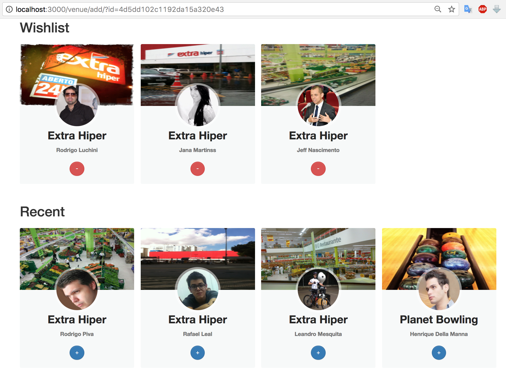

Jaya - Developer Test Wishlister
=============

Initial Setup
-----

Access your terminal and run the following command line.

Step 1
-----

```
mvn clean install
```

Step 2
-----

```
java -jar target/wishlister-0.0.1-SNAPSHOT.jar
```

Step 3
-----

Acess [http://localhost:3000/](http://localhost:3000/)

Result
--------------


